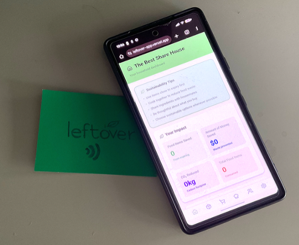
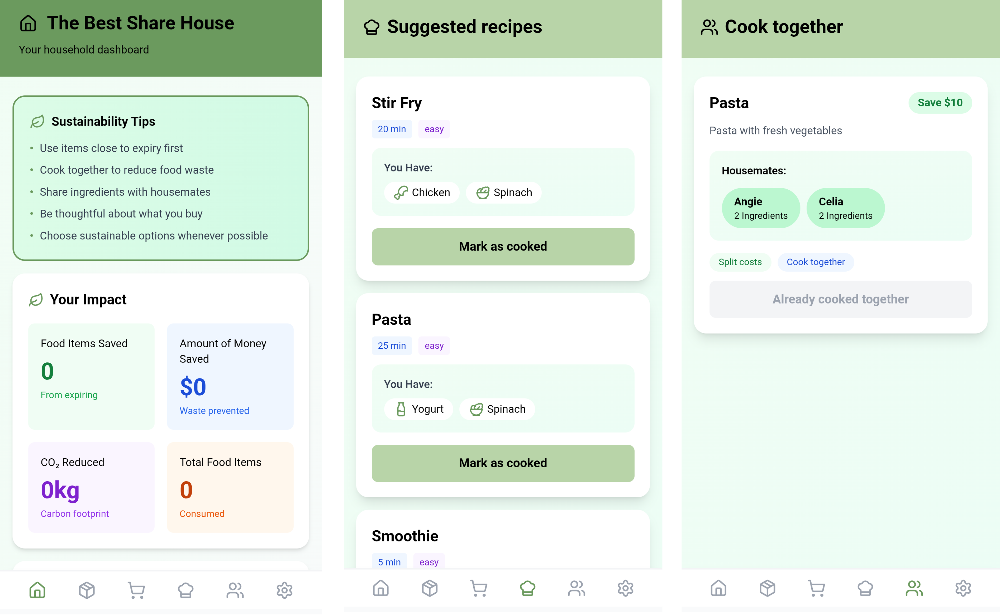
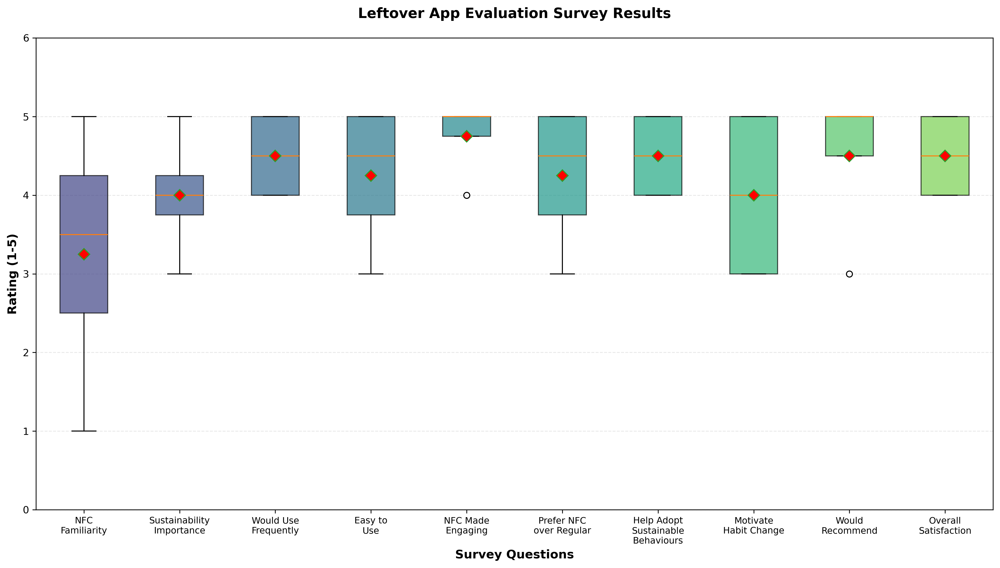

## Research Question, Plan, and Conclusions

### Research Question

The research question that will be explored and answered is: How does NFC tag interaction influence sustainable food management and consumption behaviours among university students living in shared accommodation?

With reference to the United Nations Sustainable Development Goals, the main problem that will be addressed is reduce food waste, particularly looking at promoting responsible consumption and production. A sub-UN Sustainable Develpoment goal that will be addressed includes climate action as well.

An estimated 2.5 million tonnes of household food waste generated in 2017. In 2024, ANU hopes to reduce food waste by 6% equating to 576 kilos of food waste. This statistic is important as some participants that took part in the study live at ANU shared accommodation.

The solution for this problem is an NFC-enabled mobile web app for food management and tracking. Complimentary to the app, a physical NFC tag was developed to put on your fridge.

### Plan

For the study, a working web app prototype with real NFC functionality was developed, with reference to existing literature. Four participants of university students living in shared accommodation took part in the study. An evaluation task was developed to test the prototype. Each session with the participant was around 15 minutes and they were given an interaction task to interact and test the web app. Following, an System Usability Survey (SUS) survey and interview were conducted to collect both quantitative and qualitative data.

### Conclusions

The key finding from this study include an SUS Score: 82.5/100. For ease of use, participants rated it 4.5/5, 100% of the participants agreed that the app would help them to adopt sustainable behaviours as well as an average rating of 4.75/5 for motivation was given.

It was observed that users valued solving real-life problems such as the knowing what's in your fridge or having a shopping list and appreciated the user-friendly and functional design. Users also found that the NFC interaction was motivating and there is potential to change their habits. However, some users found it difficult to discover all the features in the session.

## Prototype Design and Features

### Prototype Design

With reference to research, there were several iterations in the design process of making this prototype. Initially, there was debate on whether to use an NFC tag or a QR code. NFC found to be more easily accessible with just one tap. Whereas a QR code had many more steps. Additionally, the prototype cannot be stuck on the fridge as the particular NFC tags used do not work well attached to metal. It was found later, there are anti-metal NFC tags that work better in functionality.

A physical NFC tag would address several contextual situtaions including: making a shopping list, checking what leftovers you have, need recipes for dinner or want to cook together and save money.

A web app was useful for the front-end interface that the participants interacted with. Participants can test the NFC during the evaluation task and recreate as closely as possible how they would interact with the prototype in a contextual situation.

Prototype

NFC tag

### Prototype Features

The features of the prototype include:

1. Fridge and food inventory management
2. Ability to add items with expiry dates and who owns it
3. Alerts on dashboard when food is about to expire
4. Impact dashboard to show food waste reduction and carbon footprint
5. AI-powered recipe suggestions, even recipes to collaborate with your housemates
6. NFC tag that can be place on to your fridge

User interface of web app

## Research Data, Analysis and Findings

### Evaluation Task

The interaction task for participants included:

1. Sign up: Decide on house name. Add at least 2 housemates. I
2. Navigate to your Fridge and add at least 1 ingredient for each housemate.
3. Navigate to Shopping and add at least 1 item.
4. Navigate to Recipes and observe. If there are any recipes, mark 1 as already cooked.
5. Navigate to Collab and observe. If there are any collaborative recipes, mark 1 as already cooked together.

While they did this, observations were noted particularly frustrations or features that they did not discover. A survey and an interview were conducted. Results were then analysed by plotting a boxplot and a thematic analysis was conducted.

### Research Analysis

All participants successfully used the NFC tag, although there was some delay on finding the correct position against the phone for the web app to activate.

Looking at the individual SUS scores: P1 got 85, P2 was 77.5, P3 hit 87.5, and P4 scored 80. The overall average was 82.5 which is Grade A compared to industry standards and apps these days.

Looking at the boxplot, NFC Made Engaging shows the highest and most consistent ratings, with a median around 4.8 which indicates users strongly agree this feature is engaging. Prefer NFC over Regular, Help Adopt Sustainable Behaviours, Would Recommend and Overall Satisfaction all show strong median ratings.

However, NFC Familiarity has the lowest ratings with a median around 3.5.

Amongst the interviews, participants claimed "App is very engaging, and the features are intuitive and easy to use", "I really like how you are aware of the contents of your fridge and their expiry at a glance" as well as "I forget what I have at home when shopping, so I end up buying stuff I don't need. This would help."

With reference to Likert scale questions, participants rated on average "NFC made the app more engaging" a 4.0, "I prefer NFC over regular app" a 3.75, "App would help me adopt sustainable behaviours" a 4.75 and app would motivate habit change" a 4.5.

Leftover App Evaluation Survey Results

### Findings

Four main themes emerged from the analysis which include solving real world problems, aesthetic and semi-functional design, hidden features problem as well as NFC positive interactivity.

Users showed positive attitudes towards the ability to coordinate shopping and collective food management. Additionally, appreciate the metrics that can be seen on the dashboard which was motivating. The main problem was that some features were not obvious enough and hence some users were lost. To solve this issue, it was suggested that a tutorial of all the features would help.

To answer the research question, NFC tag interaction does influence sustainable food management behaviours. It makes tracking effortless, creates waste awareness and participants agreed it would help them adopt sustainable habits.

### Limitations and Design Recommendations

There were several limitations about the study. It was a short-term evaluation on a small sample size. There was no longitudinal study on whether the prototype would help reduce was and promote sustainable behaviours.

In terms of improvement, some design recommendations include having a walkthrough on key features to improve discoverability, adding sustainability tips as well as create recognition and milestones to increase user motivation.

## Acknowledgements

### Participants

The author would like to thank all research participants for their time and insights. Participant names have been kept private in accordance with research ethics guidelines.

### Use of AI

[1] Generative AI: Claude was used to guide through the set-up of the web app including how to launch on Vercel, using react, using icons, fonts and the general basic structure of the app. The basic structure was then used to build on advanced features without the use of AI.

## References

[1] Australian National University. Waste not, want not: How residential halls are minimising food waste and easing student financial. <https://www.anu.edu.au/news/all-news/waste-not-want-not-how-residential-halls-are-minimising-food-waste-and-easing-student-financial>. Accessed 15 Oct 2025.

[2] End Food Waste Australia. (2023). National Benchmarking Survey - Final. <https://endfoodwaste.com.au/wp-content/uploads/2023/11/NationalBenchmarkingSurvey-Final.pdf>. Accessed 20 Oct 2025.

[3] Krupp, B., Baharloo, R., & Rao, J. (2022). Campus plate: connecting students on college campuses to reduce food waste and food insecurity. Proceedings of the Conference on Research in Adaptive and Convergent Systems (RACS '22). <https://dl.acm.org/doi/10.1145/3538641.3561506>. Accessed 20 Oct 2025.

[4] Li, J., Cheng, Y., Wang, M., & Tao, X. (2024). Comparative Technical Analysis of QR Code and NFC in Contactless Payments. Proceedings of the 2024 10th International Conference on Computer Technology Applications (ICCTA '24). <https://dl.acm.org/doi/10.1145/3674558.3674593>. Accessed 22 Oct 2025.

[5] Martinho, G., Gomes, A., Ramos, M., Santos, P., Gonçalves, G., Fonseca, M., & Pires, A. (2023). Toward food waste reduction at universities. Environment, Development and Sustainability. <https://doi.org/10.1007/s10668-023-03300-2>. Accessed 20 Oct 2025.

[6] United Nations. Sustainable Development Goals. <https://sdgs.un.org/goals>. Accessed 25 Oct 2025.

[7] Yu, Y., Yi, S., Nan, X., Lo, L., Shigyo, K., Xie, L., Wicksana, J., Cheng, K., & Qu, H. (2023). FoodWise: Food Waste Reduction and Behavior Change on Campus with Data Visualization and Gamification. Proceedings of the 6th ACM SIGCAS/SIGCHI Conference on Computing and Sustainable Societies (COMPASS '23). <https://dl.acm.org/doi/10.1145/3588001.3609364>. Accessed 23 Oct 2025.
